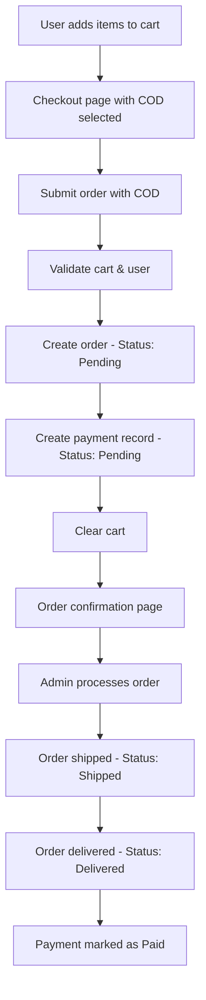
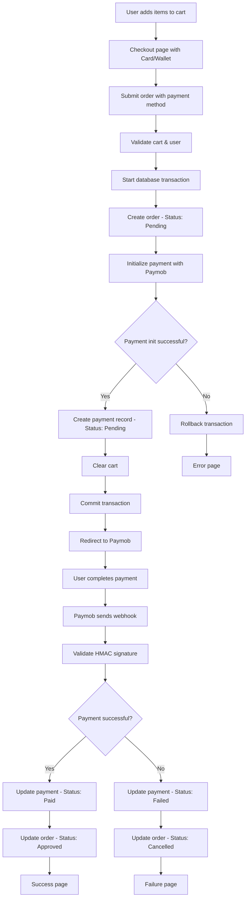
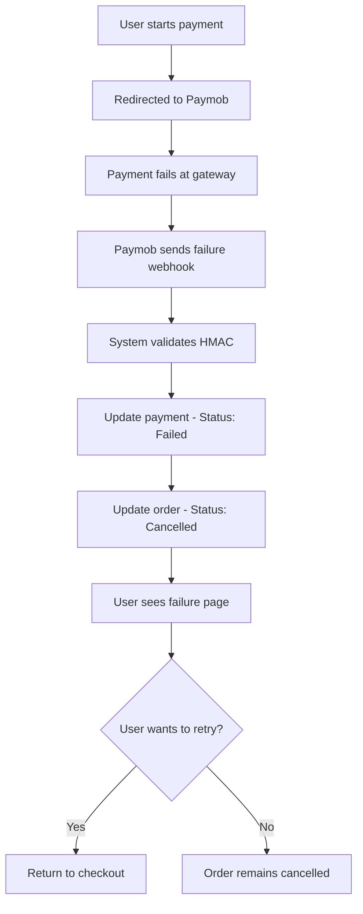
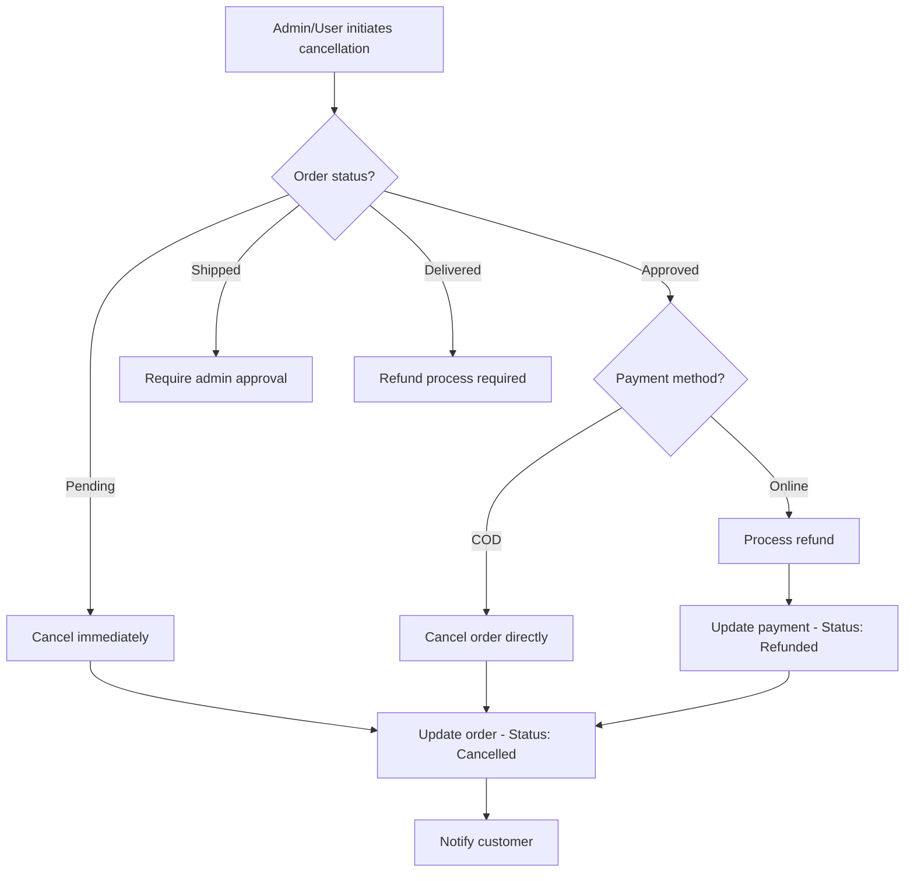

# 📋 Complete Order Payment Flow Documentation

## Table of Contents
1. [System Overview](#system-overview)
2. [Status Enums & States](#status-enums--states)
3. [Payment Methods](#payment-methods)
4. [Core Flow Scenarios](#core-flow-scenarios)
5. [Status Transition Rules](#status-transition-rules)
6. [Error Handling & Edge Cases](#error-handling--edge-cases)
7. [Security & Validation](#security--validation)
8. [API Endpoints Reference](#api-endpoints-reference)
9. [Database Schema](#database-schema)
10. [Integration Points](#integration-points)

---

## System Overview

The AseerAlkotb Order Payment Flow is a comprehensive e-commerce system that handles book orders from cart checkout to payment completion. The system supports multiple payment methods and ensures data consistency through atomic transactions and status synchronization.

### Key Components
- **Frontend**: Angular application for user interactions
- **Backend**: ASP.NET Core Web API with Entity Framework
- **Payment Gateway**: Paymob integration for online payments
- **Database**: SQL Server with relational data model
- **Security**: HMAC validation, IP whitelisting, rate limiting

---

## Status Enums & States

### OrderStatus Enum
```csharp
public enum OrderStatus
{
    Pending = 1,     // Initial state after order creation
    Approved = 2,    // Payment confirmed for online payments
    Shipped = 3,     // Order dispatched from warehouse
    Delivered = 4,   // Order received by customer
    Cancelled = 5    // Order cancelled (any stage)
}
```

### PaymentStatus Enum
```csharp
public enum PaymentStatus
{
    Pending = 1,           // Initial state / COD pending
    Processing = 2,        // Payment gateway processing
    Paid = 3,             // Payment successfully completed
    Failed = 4,           // Payment failed/declined
    Cancelled = 5,        // Payment cancelled by user/system
    Refunded = 6,         // Full refund processed
    PartiallyRefunded = 7 // Partial refund processed
}
```

### PaymentMethod Enum
```csharp
public enum PaymentMethod
{
    CashOnDelivery = 1,  // COD - Pay on delivery
    Card = 2,            // Credit/Debit cards via Paymob
    Wallet = 3           // Mobile wallets (Vodafone Cash) via Paymob
}
```

---

## Payment Methods

### 1. Cash on Delivery (COD) 💵
**Process Flow:**
1. Customer selects COD during checkout
2. Order created with `OrderStatus.Pending`
3. Payment record created with `PaymentStatus.Pending`
4. No external payment gateway interaction
5. Payment marked as `Paid` when order is `Delivered`

**Characteristics:**
- ✅ No online payment required
- ✅ Payment collected on delivery
- ✅ Lower cart abandonment rate
- ⚠️ Risk of order cancellation/rejection

### 2. Credit/Debit Cards 💳
**Process Flow:**
1. Customer selects Card payment
2. Order created with payment initialization
3. Redirect to Paymob payment gateway
4. Customer enters card details
5. 3D Secure authentication (if required)
6. Webhook/callback notifications received
7. Status updated based on payment result

**Characteristics:**
- ✅ Immediate payment confirmation
- ✅ Reduced delivery risk
- ✅ 3D Secure fraud protection
- ⚠️ Potential cart abandonment at payment

### 3. Mobile Wallets 📱
**Process Flow:**
1. Customer selects Wallet payment (Vodafone Cash)
2. Order created with payment initialization
3. Redirect to Paymob wallet interface
4. Customer authorizes payment via mobile
5. Instant confirmation (typically)
6. Webhook/callback notifications received
7. Status updated based on payment result

**Characteristics:**
- ✅ Fast, convenient payment
- ✅ High success rates in Egypt
- ✅ Instant confirmation
- ⚠️ Limited to specific operators

---

## Core Flow Scenarios

### Scenario 1: Cash on Delivery Success Flow



**Database State Changes:**
1. **Order Creation**: `OrderStatus.Pending`, `PaymentStatus.Pending`
2. **Order Shipped**: `OrderStatus.Shipped`, `PaymentStatus.Pending`
3. **Order Delivered**: `OrderStatus.Delivered`, `PaymentStatus.Paid`

### Scenario 2: Online Payment Success Flow (Card/Wallet)



**Database State Changes:**
1. **Order Creation**: `OrderStatus.Pending`, `PaymentStatus.Pending`
2. **Payment Success**: `OrderStatus.Approved`, `PaymentStatus.Paid`
3. **Payment Failure**: `OrderStatus.Cancelled`, `PaymentStatus.Failed`

### Scenario 3: Payment Failure Flow



### Scenario 4: Order Cancellation Flow



---

## Status Transition Rules

### Order Status Transitions

| From Status | To Status | Conditions | Trigger |
|-------------|-----------|------------|---------|
| Pending | Approved | Online payment successful | Payment webhook |
| Pending | Cancelled | Payment failed / User cancellation | Payment failure / Admin action |
| Approved | Shipped | Admin processes shipment | Admin action |
| Approved | Cancelled | Admin cancellation / Refund | Admin action |
| Shipped | Delivered | Package delivered | Admin/Delivery confirmation |
| Shipped | Cancelled | Delivery failure / Return | Admin action |
| Delivered | *(No change)* | Final state for successful orders | - |
| Cancelled | *(No change)* | Final state for cancelled orders | - |

### Payment Status Transitions

| From Status | To Status | Conditions | Trigger |
|-------------|-----------|------------|---------|
| Pending | Processing | Gateway processing | Payment gateway |
| Pending | Paid | Payment successful | Payment gateway webhook |
| Pending | Failed | Payment declined/failed | Payment gateway webhook |
| Pending | Cancelled | User/system cancellation | User action / System timeout |
| Processing | Paid | Payment completed | Payment gateway webhook |
| Processing | Failed | Payment declined | Payment gateway webhook |
| Paid | Refunded | Full refund processed | Admin action |
| Paid | PartiallyRefunded | Partial refund processed | Admin action |

### Business Rules for Status Synchronization

#### Cash on Delivery (COD)
```csharp
// COD payment follows order status
OrderStatus.Delivered + COD → PaymentStatus.Paid
OrderStatus.Cancelled + COD → PaymentStatus.Cancelled
```

#### Online Payments (Card/Wallet)
```csharp
// Order status follows payment status
PaymentStatus.Paid + Pending Order → OrderStatus.Approved
PaymentStatus.Failed + Pending Order → OrderStatus.Cancelled
```

---

## Error Handling & Edge Cases

### 1. Payment Gateway Timeout

**Scenario**: Paymob doesn't respond within timeout period
```
User Experience: "Payment processing failed. Please try again."
System Action: 
- Rollback order transaction
- Log timeout error
- Return user to checkout page
```

### 2. Invalid HMAC Signature

**Scenario**: Webhook received with invalid/tampered signature
```
User Experience: "Security check failed. Please contact support."
System Action:
- Reject webhook
- Log security violation
- Show security error page
- No status changes applied
```

### 3. Duplicate Payment Processing

**Scenario**: Multiple webhooks for same transaction
```
System Behavior:
- Check if payment already processed
- Return "Payment already processed" 
- No status changes
- Log duplicate attempt
```

### 4. Order Not Found

**Scenario**: Webhook references non-existent order
```
System Response:
- Return 400 Bad Request
- Log missing order error
- No processing attempted
```

### 5. Network Connectivity Issues

**Scenario**: Network failure during checkout
```
Automatic Retry Logic:
- Maximum 3 retry attempts
- Exponential backoff: 2s, 5s, 10s
- Fallback to error page after max retries
```

### 6. Cart Modified During Checkout

**Scenario**: Cart items changed while user is paying
```
Validation Process:
- Validate cart contents before order creation
- Check stock availability
- Recalculate totals
- If changes detected: Show updated cart, require confirmation
```

---

## Security & Validation

### 1. HMAC Signature Validation

**Purpose**: Ensure webhook authenticity from Paymob
```csharp
// 20 critical fields concatenated and hashed
Fields: amount_cents, created_at, currency, error_occured, 
        has_parent_transaction, id, integration_id, is_3d_secure,
        is_auth, is_capture, is_refunded, is_standalone_payment,
        is_voided, order, owner, pending, source_data.pan,
        source_data.sub_type, source_data.type, success

Algorithm: HMAC-SHA512
Comparison: Constant-time to prevent timing attacks
```

### 2. IP Whitelisting

**Allowed IPs**: Paymob production servers
```
- 34.200.173.150 (specific Paymob IP)
- 34.200.0.0/16 (AWS US-East-1 range)
- 52.0.0.0/16, 54.0.0.0/16 (AWS ranges)
```

### 3. Timestamp Validation

**Window**: Configurable validation window (180 minutes for development)
```csharp
// Prevent replay attacks
if (callbackAge > ValidationWindow) {
    return "Timestamp outside valid window";
}
```

### 4. Rate Limiting

**Policies**:
- Webhooks: 20 requests per minute
- Callbacks: 10 requests per minute
- General API: Standard ASP.NET Core rate limiting

### 5. Input Validation

**Validation Points**:
- Cart contents and availability
- User authentication and authorization
- Payment method compatibility
- Address and contact information
- Amount calculations and currency

---

## API Endpoints Reference

### Order Management

#### `POST /api/Orders/Checkout`
**Purpose**: Create new order with payment initialization

**Request Body**:
```typescript
interface CheckoutRequest {
  FirstName: string;
  LastName: string;
  StreetAddress: string;
  PhoneNumber: string;
  Governorate: EgyptGovernorates;
  City: EgyptCities;
  PaymentMethod: PaymentMethod;
}
```

**Response**:
```typescript
interface AddOrderResponse {
  orderId: number;
  trackingNumber: string;
  paymentInfo?: PaymentInitializationInfo;
}

interface PaymentInitializationInfo {
  paymentId: number;
  transactionId: string;
  paymentMethod: PaymentMethod;
  amount: number;
  currency: string;
  status: PaymentStatus;
  redirectUrl?: string;
  instructions?: string;
  requiresRedirect: boolean;
}
```

#### `POST /api/Orders/Cancel`
**Purpose**: Cancel existing order

**Request**: `{ trackingNumber: string }`
**Response**: Cancellation confirmation

#### `GET /api/Orders/User/GetAll`
**Purpose**: Get user's order history with pagination

#### `GET /api/Orders/User/GetByTrackingNumber`
**Purpose**: Get specific order details by tracking number

### Payment Management

#### `POST /api/payment/initialize`
**Purpose**: Initialize payment for an order

**Request**: `InitializePaymentRequest`
**Response**: Payment initialization details with redirect URL

#### `POST /api/payment/webhook`
**Purpose**: Handle Paymob server-to-server notifications

**Security**: HMAC validation, IP whitelisting, rate limiting
**Processing**: Automatic status updates based on payment result

#### `GET /api/payment/callback`
**Purpose**: Handle user redirect after payment

**Parameters**: All payment result parameters from Paymob
**Response**: HTML page showing payment result to user

#### `GET /api/payment/methods`
**Purpose**: Get available payment methods

**Response**: List of supported payment methods with display names

---

## Database Schema

### Orders Table
```sql
CREATE TABLE Orders (
    Id INT IDENTITY(1,1) PRIMARY KEY,
    TrackingNumber NVARCHAR(100) NOT NULL UNIQUE,
    UserId INT NOT NULL,
    FirstName NVARCHAR(100) NOT NULL,
    LastName NVARCHAR(100) NOT NULL,
    StreetAddress NVARCHAR(500) NOT NULL,
    PhoneNumber NVARCHAR(20) NOT NULL,
    Governorate INT NOT NULL,
    City INT NOT NULL,
    OrderDate DATETIME2 NOT NULL,
    Status INT NOT NULL, -- OrderStatus enum
    PaymentStatus INT NOT NULL, -- PaymentStatus enum
    PaymentMethod INT NOT NULL, -- PaymentMethod enum
    TotalAmount DECIMAL(18,2) NOT NULL,
    FinalAmount DECIMAL(18,2) NOT NULL,
    ShippingCost DECIMAL(18,2) NOT NULL,
    TaxAmount DECIMAL(18,2) NOT NULL,
    DiscountAmount DECIMAL(18,2) NOT NULL,
    CreatedAt DATETIME2 NOT NULL,
    UpdatedAt DATETIME2 NOT NULL
);
```

### Payments Table
```sql
CREATE TABLE Payments (
    Id INT IDENTITY(1,1) PRIMARY KEY,
    UserId INT NOT NULL,
    OrderId INT NOT NULL,
    TransactionId NVARCHAR(200) NOT NULL,
    Amount DECIMAL(18,2) NOT NULL,
    Currency NVARCHAR(10) NOT NULL,
    Method INT NOT NULL, -- PaymentMethod enum
    Status INT NOT NULL, -- PaymentStatus enum
    PaymentDate DATETIME2 NOT NULL,
    PaymobOrderId BIGINT NULL,
    ProviderPayload NVARCHAR(MAX) NULL,
    CreatedAt DATETIME2 NOT NULL,
    UpdatedAt DATETIME2 NOT NULL
);
```

### OrderItems Table
```sql
CREATE TABLE OrderItems (
    OrderId INT NOT NULL,
    BookId INT NOT NULL,
    Quantity INT NOT NULL,
    UnitPrice DECIMAL(18,2) NOT NULL,
    PRIMARY KEY (OrderId, BookId)
);
```

---

## Integration Points

### 1. Paymob Payment Gateway

**API Endpoints**:
- `POST /v1/intention/` - Create payment intention
- Webhook notifications for transaction updates
- Redirect URLs for user interaction

**Integration Features**:
- Multi-payment method support (Cards, Wallets)
- 3D Secure authentication
- Real-time status notifications
- Comprehensive transaction data

### 2. Frontend Angular Application

**Key Components**:
- Cart management service
- Checkout page with form validation
- Order history and tracking
- Payment result pages

**State Management**:
- Session storage for pending payments
- Local storage for cart persistence
- Route-based payment return handling

### 3. Admin Dashboard

**Order Management**:
- Order status updates
- Payment reconciliation
- Customer support tools
- Reporting and analytics

### 4. Email/SMS Notifications

**Trigger Points**:
- Order confirmation
- Payment success/failure
- Shipping notifications
- Delivery confirmation

---

## Testing Scenarios

### 1. Successful COD Order
```
1. Add items to cart
2. Proceed to checkout
3. Select "Cash on Delivery"
4. Fill in delivery details
5. Submit order
6. Verify order created with Pending status
7. Admin marks as Shipped
8. Admin marks as Delivered
9. Verify payment status updated to Paid
```

### 2. Successful Card Payment
```
1. Add items to cart
2. Proceed to checkout
3. Select "Credit/Debit Card"
4. Submit order
5. Redirected to Paymob
6. Enter valid card details
7. Complete 3D Secure (if required)
8. Payment processed successfully
9. Redirected to success page
10. Verify order status: Approved
11. Verify payment status: Paid
```

### 3. Failed Card Payment
```
1. Follow steps 1-6 from successful card payment
2. Enter invalid/declined card details
3. Payment fails at gateway
4. Redirected to failure page
5. Verify order status: Cancelled
6. Verify payment status: Failed
7. User can retry payment
```

### 4. Payment Security Test
```
1. Complete successful payment
2. Manually modify callback URL (success=false to success=true)
3. Verify system rejects tampered callback
4. Verify HMAC validation fails
5. Verify security error page shown
6. Verify no unauthorized status changes
```

### 5. Network Failure Simulation
```
1. Start checkout process
2. Disconnect network during payment init
3. Verify graceful error handling
4. Verify transaction rollback
5. Verify user returned to checkout
6. Reconnect and retry successfully
```

---

## Performance Considerations

### 1. Database Optimization
- Indexed columns: TrackingNumber, UserId, TransactionId
- Connection pooling for high concurrency
- Optimized queries with proper includes
- Transaction scoping to minimize lock time

### 2. Payment Gateway Optimization
- 30-second timeout for API calls
- Retry logic with exponential backoff
- Connection reuse for multiple requests
- Circuit breaker pattern for fault tolerance

### 3. Caching Strategy
- Payment methods cached for 1 hour
- User cart cached in session
- Static reference data cached globally

### 4. Monitoring & Alerting
- Payment success/failure rates
- Gateway response times
- HMAC validation failures
- Database transaction duration

---

## Troubleshooting Guide

### Common Issues

#### 1. "Payment not found" in webhook
**Cause**: Transaction ID mismatch
**Solution**: Verify TransactionId format and database queries

#### 2. "Invalid signature" error
**Cause**: HMAC secret mismatch or field ordering
**Solution**: Verify HMAC secret in configuration and field concatenation

#### 3. Orders stuck in Pending status
**Cause**: Webhook delivery failure
**Solution**: Check webhook URL accessibility and logs

#### 4. Cart appears empty during checkout
**Cause**: Session timeout or concurrent modifications
**Solution**: Implement cart refresh and validation

#### 5. Duplicate order creation
**Cause**: Double-click or network retry
**Solution**: Implement request deduplication

### Debugging Tools

#### Log Analysis
```bash
# Search for payment processing errors
grep "Payment.*failed" logs/

# Check HMAC validation issues
grep "HMAC.*Invalid" logs/

# Monitor webhook processing
grep "webhook.*transaction" logs/
```

#### Database Queries
```sql
-- Check order/payment status consistency
SELECT o.Id, o.Status as OrderStatus, o.PaymentStatus, p.Status as PaymentActualStatus
FROM Orders o
LEFT JOIN Payments p ON o.Id = p.OrderId
WHERE o.PaymentStatus != p.Status;

-- Recent payment activity
SELECT TOP 10 * FROM Payments ORDER BY CreatedAt DESC;

-- Failed payments in last 24 hours
SELECT * FROM Payments 
WHERE Status = 4 AND CreatedAt > DATEADD(day, -1, GETDATE());
```

---

## Production Deployment Checklist

### Pre-Deployment
- [ ] Configure production Paymob credentials
- [ ] Update webhook URLs to production domain
- [ ] Set up SSL certificates and HTTPS
- [ ] Configure production database connection
- [ ] Set up monitoring and alerting
- [ ] Configure backup strategies
- [ ] Load test payment processing
- [ ] Security audit and penetration testing

### Configuration Updates
- [ ] Reduce timestamp validation window to 30-60 minutes
- [ ] Enable production logging levels
- [ ] Configure rate limiting for production traffic
- [ ] Set up database connection pooling
- [ ] Configure caching strategies
- [ ] Set up application insights/monitoring

### Post-Deployment
- [ ] Monitor payment success rates
- [ ] Verify webhook processing
- [ ] Test all payment methods
- [ ] Monitor system performance
- [ ] Verify security measures
- [ ] Set up automated backup verification
- [ ] Train support team on troubleshooting

---

## Conclusion

The AseerAlkotb Order Payment Flow is a comprehensive, secure, and scalable e-commerce solution that handles multiple payment methods with robust error handling and security measures. The system ensures data consistency through atomic transactions, provides excellent user experience through proper status management, and maintains security through HMAC validation and other security measures.

The modular architecture allows for easy extension and maintenance, while comprehensive logging and monitoring ensure reliable operation in production environments.

For technical support or questions about this documentation, please refer to the development team or the specific implementation files mentioned throughout this document.